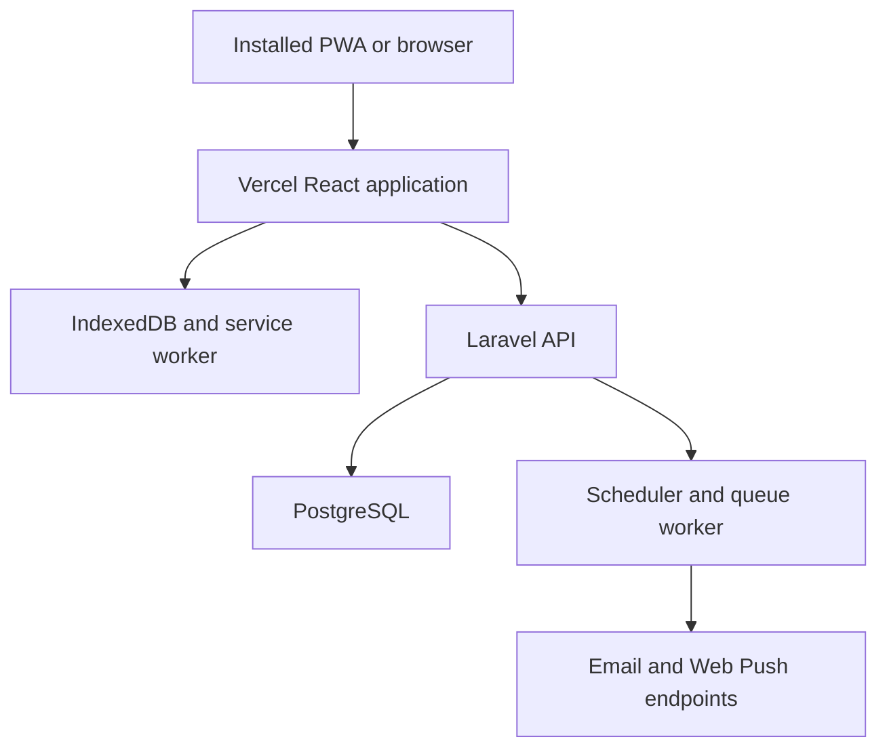
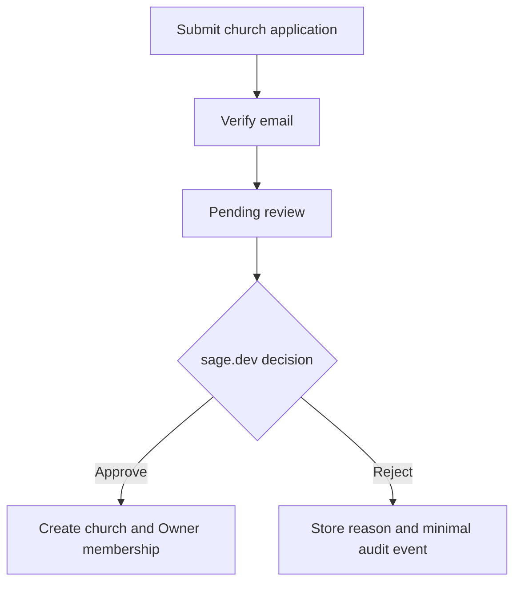
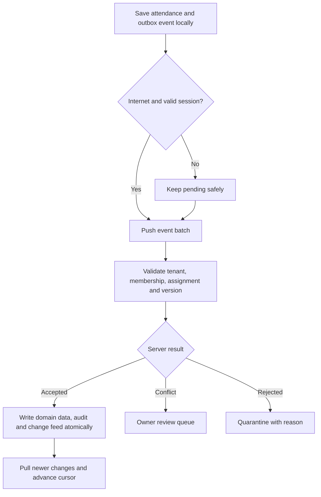

# MinistrySprout — Product and Architecture Design

**Status:** Approved  
**Date:** 2026-08-20  
**Product name:** `MinistrySprout`  
**PWA short name:** `Sprout`  
**Tagline:** *Children's ministry, ready anywhere.*  
**Repository:** [`Frierend/ministry-sprout`](https://github.com/Frierend/ministry-sprout) (private)  
**Reference repository:** [`Frierend/kids-ministry-app`](https://github.com/Frierend/kids-ministry-app) (read-only behavioral reference)

## 1. Executive Summary

This document defines MinistrySprout, a new, independent web application for church children's ministry attendance. It recreates the useful attendance behavior of the existing Expo application as an installable, responsive Progressive Web App (PWA), while adding multi-church tenancy, secure accounts, offline attendance, online synchronization, auditability, student birthdates, birthday reminders, and safe XLSX/CSV student import.

The project will be created in a completely separate GitHub repository. It will not fork, overwrite, share Git history with, or deploy from `Frierend/kids-ministry-app`. The original Expo project remains unchanged and may only be consulted as a read-only product-behavior reference.

The first release deliberately excludes points, Market Day, child photo uploads, messaging, billing, and advanced analytics. This narrow scope keeps synchronization dependable, protects children's data, and limits infrastructure cost.

## 2. Product Goals

The MVP must let an approved church:

1. Create a protected church workspace.
2. Invite individual teachers and assign ministries.
3. Manage ministries and student rosters.
4. Store optional student birthdates and use default gender avatars.
5. Import students safely from XLSX or CSV.
6. Install or use the app from phones, tablets, laptops, and desktops.
7. Download assigned rosters for authorized offline use.
8. Record and finalize attendance without internet access.
9. Synchronize attendance safely when connectivity returns.
10. Resolve contradictory submissions without silently losing data.
11. Send privacy-safe birthday reminders at 8:00 AM in the church timezone.
12. Maintain platform, church, security, and operational audit trails.

### 2.1 Non-Goals for Version One

- Points or rewards ledger
- Market Day or inventory
- Child or teacher photo uploads
- Guardian/contact records in the MVP
- Messaging, announcements, or chat
- Billing, subscriptions, or payment processing
- Public teacher self-registration
- Advanced predictive analytics
- Automatic migration of the Expo SQLite database
- Native Android or iOS binaries

## 3. Independent Repository Boundary

The new project will use one standalone monorepo:

```text
ministry-sprout/
├── apps/
│   ├── web/          React, TypeScript, PWA, IndexedDB
│   └── api/          Laravel API, scheduler, queue jobs
├── contracts/        OpenAPI request and response definitions
├── docs/             Product, architecture, security, and operations
└── .github/          CI, dependency, secret, and security workflows
```

Repository rules:

- The new repository starts with a new Git history.
- It is not a fork or submodule of the Expo repository.
- No deployment secrets, database, environment, or CI workflow are shared.
- No code is copied blindly; behavior is reimplemented against this approved specification.
- Any later migration from the old app is a separately designed and approved project.

The monorepo keeps the React frontend, Laravel backend, API contract, documentation, and CI changes reviewable together while preserving separate deployment targets.

## 4. Technical Architecture

### 4.1 Selected Stack

| Layer | Technology | Responsibility |
|---|---|---|
| Web client | React + TypeScript | Responsive role-based user interface |
| PWA | Web App Manifest + Service Worker | Installation, application-shell caching, update lifecycle |
| Offline data | IndexedDB through Dexie | Authorized roster cache, drafts, per-profile outbox |
| API | Laravel | Authentication, authorization, domain rules, sync, imports, reports |
| Authentication | Laravel Fortify + Sanctum | Registration workflow, sessions, email verification, MFA |
| Database | PostgreSQL | Authoritative multi-tenant data and append-only audit events |
| Tenant defense | Application scoping + PostgreSQL RLS | Prevent cross-church data access |
| Background work | Laravel scheduler and database-backed queues | Birthday pushes, email, imports, retries, maintenance |
| Frontend hosting | Vercel | React PWA and external `/api/*` rewrite |
| Backend hosting | Railway initially | Laravel API/worker and PostgreSQL |
| API contract | OpenAPI | Stable frontend/backend interface and contract testing |

Redis and object storage are not required for the initial release. PostgreSQL-backed queues are sufficient for the expected pilot volume.

### 4.2 System Topology



Vercel may proxy `/api/*` to Laravel so browser requests remain same-origin. The service worker must not cache API responses as if they were static files; authorized domain data belongs in IndexedDB under explicit sync control.

## 5. Tenancy, Accounts, and Roles

### 5.1 Platform Administrator

`sage.dev` is a platform-only administrative identity:

- It is stored separately from church user memberships.
- Its private verification and recovery address is the developer's personal Gmail.
- It is online-only and has no offline roster cache.
- MFA is mandatory.
- It cannot access child records through normal platform administration.
- It reviews church applications, suspends workspaces, observes sanitized system health, and views platform audit events.
- It is created through a one-time deployment bootstrap invitation. No password is hardcoded or committed, and the bootstrap secret is removed after setup.

The developer will use a separate normal account when testing Church Owner or Teacher behavior.

### 5.2 Church Roles

| Role | Permissions |
|---|---|
| Church Owner | All administration within one church, attendance, reports, imports, conflicts, audit view |
| Teacher | Assigned ministries, assigned rosters, attendance, own recent sessions and sync status |

MVP rules:

- Each church has exactly one active Church Owner.
- Ownership transfer is online-only, reauthenticated, MFA-protected, and audited.
- Teachers cannot grant roles or assign themselves to ministries.
- Teachers cannot edit server-finalized sessions.
- Permanent corrections are Owner-only, online-only revisions.
- Every API operation rechecks church membership and ministry assignment; UI visibility is never treated as authorization.

### 5.3 Public Registration and Approval

Public registration is available only for prospective Church Owners.



Before approval, the applicant cannot create children, invite teachers, download data, or consume a complete tenant workspace. Registration uses rate limiting, CAPTCHA, email verification, input limits, and duplicate-application detection. Application uploads are not supported.

## 6. End-to-End User Flow

### 6.1 Church Onboarding

1. A prospective Owner registers and verifies their email.
2. They submit minimal church information and timezone.
3. The application remains Pending.
4. `sage.dev` reviews metadata and approves or rejects with a reason.
5. Approval atomically creates the church and Primary Owner membership.
6. The Owner enrolls MFA before entering the new workspace.
7. The Owner completes setup: church information, ministries, students, and teacher invitations.
8. Every approval, rejection, invitation, assignment, and ownership action produces an audit event.

### 6.2 Teacher Onboarding

1. The Owner invites a teacher by email and assigns one or more ministries.
2. The teacher accepts the time-limited invitation online.
3. The teacher verifies their account and signs in.
4. They use the browser or install the PWA.
5. They create a local device profile and PIN.
6. The app downloads only their assigned ministries and rosters.
7. Successful synchronization issues a 14-day offline authorization lease.

### 6.3 Shared Device

1. The app opens to a profile picker.
2. Selecting a teacher requires that profile's local PIN.
3. Only the selected profile's cache and outbox are unlocked.
4. Switching profiles locks the previous profile and clears its active server session.
5. Each profile keeps a separate queue and actor identity.
6. Online synchronization may require the selected teacher to authenticate again.

### 6.4 Attendance

1. The teacher chooses an assigned ministry and attendance date.
2. A local draft is created immediately.
3. Each child is marked Present, Absent, or remains Unmarked.
4. Search, bulk marking, and temporary guest entry are available.
5. Every change is saved to IndexedDB in the same transaction as its local event.
6. Finalization is blocked until all regular roster entries are resolved.
7. Offline finalization shows **Saved on this device — Pending Sync**.
8. Online finalization shows **Synced** after server acknowledgement.

### 6.5 Synchronization



### 6.6 Temporary Offline Guest

1. A Teacher selects **Add Guest**.
2. They enter only a display name and optional gender.
3. The app assigns a local UUID and default avatar.
4. The guest can be marked present in the current session.
5. Synchronization creates a pending guest record.
6. The Owner promotes it to a student, links it to an existing student, or merges a duplicate.

Guardian contacts and other sensitive details are not accepted through this offline flow.

## 7. Responsive Screen Structure

| Audience | Screens |
|---|---|
| Public | Login, Register Church, Verify Email, Application Status |
| `sage.dev` | Pending Applications, Review, Active Churches, Platform Audit, System Health |
| Church Owner | Dashboard, Ministries, Students, Teachers, Attendance, Reports, Imports, Conflicts, Audit, Settings |
| Teacher | My Ministries, Take Attendance, Recent Sessions, Sync Status, Device Profile |
| Shared device | Profile Picker, PIN Unlock, Add Teacher Profile |

Responsive rules:

- Phone: large attendance rows and compact bottom navigation.
- Tablet: ministry/session pane beside the roster pane.
- Laptop/desktop: sidebar navigation and wider administration/report tables.
- Important controls use at least approximately 44–48 pixel touch targets.
- Connection states use words and icons, never color alone.
- Heavy animation and large media are avoided.
- The app remains usable in a normal browser when installation is unavailable.

The attendance screen includes the ministry/date header, marked and unmarked counts, search, bulk actions, guest entry, child rows, local save state, sync state, and a persistent Finalize action.

### 7.1 Visible Connection States

| State | User-facing behavior |
|---|---|
| Synced | Show that all changes are synced and display the last-sync time |
| Offline | Explain that attendance is saving on this device |
| Pending | Show the number of local events waiting to upload |
| Syncing | Show current upload/download activity without blocking local marking |
| Needs Review | Explain the conflict or rejection and identify the permitted next action |
| Authorization Expired | Require online sign-in before roster access continues |
| Storage Failure | Stop unsafe writes and explain how to free storage or sync safely |

### 7.2 Basic Reports

Owner reports are online-only and include date/ministry filters, Present and Absent totals, attendance rate, recent finalized sessions, pending offline submissions, conflicts, corrections, and CSV export. Teachers see only their assigned recent sessions. Reports never alter source attendance records.

## 8. Offline and Sync Design

### 8.1 Offline Boundaries

| Capability | Offline | Online |
|---|---:|---:|
| View assigned ministries and roster | Yes | Yes |
| Create, edit, and finalize attendance draft | Yes | Yes |
| Add temporary attendance guest | Yes | Yes |
| View cached recent sessions | Yes | Full history |
| View assigned birthday reminder data | Yes | Yes |
| Permanent student/ministry management | No | Owner only |
| Teacher invitations and deactivation | No | Owner only |
| Conflict resolution and corrections | No | Owner only |
| Platform administration | No | `sage.dev` only |

### 8.2 Syncable Record Rules

Every syncable record uses:

- UUID primary key
- Trusted `church_id`
- Integer version
- `created_at` and `updated_at`
- Optional `deleted_at` tombstone
- Device and actor provenance where applicable

The client writes the domain change and outbox event in one IndexedDB transaction. A push event contains `device_id`, unique `client_event_id`, base record version, action, minimal payload, and local timestamp. The server adds a trusted receive timestamp.

The server transaction validates authentication, membership, tenant, ministry assignment, authorization lease, schema, and base version. It then writes the domain change, append-only audit event, and server change-feed entry atomically.

The outbox entry is removed only after acknowledgement. Replays are safe because the server enforces idempotency on device and client event ID. Pull synchronization uses a server cursor. Deletions use tombstones so devices converge.

### 8.3 Conflict Policy

- Identical submissions are deduplicated.
- Non-overlapping changes are merged.
- Contradictory attendance values never use silent last-write-wins.
- Contradictions enter the Owner review queue.
- Server-finalized attendance is read-only for Teachers.
- An Owner correction creates a new revision and preserves the original actor, value, time, and reason.

### 8.4 Authorization Expiration and Revocation

- A successful sync renews a 14-day offline authorization lease.
- After expiration, the profile must reconnect and authenticate before roster access.
- Revocation blocks future sessions and sync immediately when online.
- On the next connection, revoked cached data is locked and safely purged.
- Unsynced submissions from a revoked or expired profile are quarantined for Owner review rather than silently accepted or discarded.

## 9. Core Data Model

| Area | Principal records |
|---|---|
| Platform | `platform_admins`, `users`, `church_applications`, `churches` |
| Access | `church_memberships`, `invitations`, `devices`, `offline_authorizations` |
| Ministry | `ministries`, `teacher_ministry_assignments`, `students`, `enrollments` |
| Attendance | `attendance_sessions`, `attendance_records`, `attendance_guests`, `attendance_revisions` |
| Notification | `push_subscriptions`, `birthday_notification_deliveries` |
| Import | `import_batches`, `import_rows` |
| Sync | `sync_events`, `change_feed`, `device_cursors`, `sync_conflicts` |
| Accountability | `audit_events`, `security_events`; sanitized external system logs |

Rules:

- All tenant-owned records carry `church_id` and are protected by application scoping and PostgreSQL RLS.
- One MVP attendance session exists per church, ministry, and date.
- One attendance record exists per session and student.
- A user receives tenant access only through an active membership.
- Exactly one active Owner membership exists per church.
- Audit events are append-only and unavailable to ordinary update/delete functions.
- Child photos have no table, upload route, import field, or object-storage dependency.

## 10. Birthdates and Birthday Notifications

### 10.1 Birthdate Handling

- `date_of_birth` is optional and stored as a date-only PostgreSQL value.
- Age is derived and never stored as an authoritative field.
- Future and implausible dates are rejected or flagged for Owner correction.
- Gender is optional; Male and Female use their corresponding built-in SVG avatar, while blank or Unspecified uses the neutral avatar.
- The Owner can view and edit the full birthdate online.
- An assigned Teacher receives only the month/day and age display needed for ministry use.
- The offline cache stores the next birthday month/day and the age the child will turn, not the full date of birth or birth year.
- `sage.dev`, technical logs, and generic platform monitoring cannot see birthdates.
- For reminder purposes, February 29 birthdays appear on February 28 in non-leap years.

### 10.2 8:00 AM Reminder

Each church stores an IANA timezone, initially defaulting to `Asia/Manila`. A Laravel scheduled job finds churches whose local time is 8:00 AM, determines today's birthdays, filters recipients by active role and ministry assignment, and dispatches one idempotent job per user/device/day.

Default system notification:

> 🎂 2 children are celebrating today. Open the app to view.

Names appear only after the authorized user opens and unlocks the app. Notification permission is opt-in per device and requested only after a deliberate user action. Owners may receive church-wide reminders; Teachers receive reminders only for assigned ministries.

Web Push is best-effort. An online subscribed device normally receives the server push at the scheduled time. If the device is offline or the browser delays delivery, the notification may arrive later. The app therefore always displays a **Today's Birthdays** card when opened. Exact offline 8:00 AM execution is not promised.

## 11. Student Input Normalization and Import

### 11.1 Safe Automatic Formatting

| Input | Normalization |
|---|---|
| Names | Trim and collapse repeated whitespace; preserve intentional capitalization |
| Birthdate | Form date picker; store as `YYYY-MM-DD` |
| Gender | Normalize recognized values to Male, Female, or Unspecified |
| Ministry | Case-insensitive match to an existing ministry |
| Blank cells | Convert to empty values rather than text placeholders |
| Ambiguous date | Flag for correction; never guess |
| Duplicate | Flag for review; never silently merge |

Input normalization happens both in the browser for usability and on the server for trust. The server is authoritative.

### 11.2 Import Template

| Column | Required | Rule |
|---|---:|---|
| `first_name` | Yes | Given name |
| `last_name` | Yes | Family name |
| `middle_name` | No | Optional |
| `preferred_name` | No | Attendance display name when supplied |
| `suffix` | No | Jr., III, and similar values |
| `birthdate` | No | `YYYY-MM-DD` or a genuine Excel date cell |
| `gender` | No | Male, Female, or Unspecified |
| `ministries` | No | Existing ministry names separated by semicolons |
| `external_reference` | No | Church-provided stable student/member reference |

Guardian contacts, photos, passwords, attendance, points, and unrestricted notes are not accepted in the MVP import.

### 11.3 Import Workflow and Safety

1. The Owner downloads the current template.
2. The Owner uploads `.xlsx` or `.csv` while online.
3. The server verifies extension, MIME type, size, row limit, structure, and safe cell types.
4. Headers are mapped and values normalized.
5. A preview separates valid, invalid, duplicate, and unknown-ministry rows.
6. The Owner corrects mappings and approves only valid rows.
7. The server creates the approved students and enrollments in an idempotent batch.
8. The app shows an audited summary and offers invalid rows as a corrected CSV.

MVP limit: 500 data rows per file. `.xls`, `.xlsm`, macros, formulas, scripts, and unsupported archives are rejected. Unknown ministries are mapped by the Owner and never created from typos. Existing students are never silently overwritten. Exact `external_reference` matches are strongest; otherwise normalized name plus birthdate is used to flag possible duplicates. Re-uploading the same confirmed batch cannot duplicate students. Spreadsheet exports escape text beginning with `=`, `+`, `-`, or `@` so child-controlled values cannot become executable spreadsheet formulas.

## 12. Security Architecture

The implementation uses OWASP ASVS and OWASP multi-tenant guidance as engineering baselines.

### 12.1 Authentication and Sessions

- Email verification is required before application review or invitation completion.
- MFA is mandatory for `sage.dev` and Church Owners.
- Passwords use Laravel's configured modern password hashing.
- Web sessions use Secure, HttpOnly, SameSite cookies and CSRF protection.
- Shared-device browser sessions allow only one active tenant profile at a time.
- Password reset and MFA recovery are rate-limited and audited.
- High-risk actions require recent authentication.

### 12.2 Local Device Protection

- Each teacher profile has a separate encrypted IndexedDB namespace and outbox.
- A per-profile encryption key protects cached payloads using Web Crypto.
- The local PIN protects the wrapped profile key and triggers an automatic lock after inactivity.
- Only the selected profile key is held in memory.
- Local PIN protection is not treated as equivalent to hardware-backed native storage; therefore cached child data remains deliberately minimal.
- Repeated PIN failures introduce increasing delays, and profile reset requires online reauthentication.

### 12.3 Application and Infrastructure Controls

- Server-side allowlists validate every request and import field.
- RLS and application scoping enforce tenant isolation.
- Output encoding and a strict Content Security Policy reduce XSS risk.
- Rate limits protect registration, authentication, imports, synchronization, and administrative actions.
- Secrets remain in deployment configuration and never enter Git history or logs.
- HTTPS is required everywhere.
- Database backups are encrypted and restore procedures are tested.
- Dependency, secret, static-analysis, and security tests run in CI.

## 13. Audit, Security, and Operational Logs

| Layer | Examples |
|---|---|
| Platform audit | Application decision, suspension, ownership transfer, `sage.dev` action |
| Church audit | Invitation, role, assignment, student/ministry change, attendance lifecycle, correction |
| Security | Login failure, MFA/reset, session/device revocation, access denial, rate limit |
| System/sync | Batch, retry, conflict, rejected event, queue failure, scheduler heartbeat, API error |

Every audit event includes an immutable UUID, actor, church scope when applicable, action, target record identifier, trusted UTC timestamp, result, device/sync batch where applicable, and correlation ID.

Rules:

- Passwords, tokens, child names, birthdates, guardian details, and raw request bodies never enter technical logs.
- `sage.dev` sees platform audit and sanitized health information, not tenant child data by default.
- Owners see their church audit history.
- Teachers see their own submissions and actionable sync errors.
- High-risk operations fail if their required audit event cannot persist.
- Audit events cannot be edited or deleted through normal application functions.

Initial retention policy:

- Tenant audit events: retained for the active tenant lifetime, partitioned for maintenance.
- Security events: 180 days.
- Sanitized technical logs: 30 days.
- Sync event receipts: at least 180 days for replay protection.
- Change-feed entries: pruned after active devices advance and the 90-day safety window passes; expired devices perform a full resync.
- Rejected application details: removed after 30 days, leaving only a minimal non-PII audit record.

After that 30-day period, an applicant-only identity with no approved membership or active application is disabled and deleted by the same cleanup job. The retained audit event uses a decision category and internal identifiers rather than the applicant's email or free-form personal details.

## 14. Error Handling and Recovery

| Failure | Required behavior |
|---|---|
| Internet unavailable | Save locally, show Offline, retry later |
| API unavailable | Preserve outbox, use bounded exponential retry with jitter |
| Authentication expired | Preserve queue, request correct teacher sign-in before upload |
| IndexedDB write/quota failure | Stop before claiming success; show recovery action and prevent unsafe finalization |
| Duplicate event | Return prior acknowledgement without duplicate domain record |
| Version conflict | Lock affected server-finalized item and send to Owner review |
| Revoked teacher | Reject/quarantine submission, lock profile, audit outcome |
| Bad import row | Exclude row, show reason, preserve valid preview rows |
| Notification failure | Retry bounded times, record sanitized delivery result, rely on in-app fallback |
| PWA update available | Never reload mid-session; prompt after local work is safe |
| Database/worker health failure | Raise sanitized `sage.dev` operational alert |

PostgreSQL is authoritative for acknowledged data. IndexedDB is authoritative only for local unsynced work. Users are warned that clearing browser storage before synchronization can remove unsynced work. The interface always shows last sync time, pending count, and failure state.

## 15. Deployment and Operations

### 15.1 Environments

- Local development uses isolated local services and test data.
- Pull requests run CI and may use Vercel frontend previews against a non-production API.
- Production uses Vercel for the PWA and Railway initially for Laravel/PostgreSQL.
- Production and test credentials/databases are never shared.

### 15.2 Release Safety

- Database migrations are reviewed for tenant scoping and data safety.
- Destructive schema changes require an explicit migration and rollback/data-recovery plan.
- The frontend service-worker update uses versioned assets and controlled activation.
- API changes remain backward-compatible with the currently deployed PWA during staged rollout.
- Health/readiness endpoints, queue heartbeat, scheduler heartbeat, sync failure rate, notification failures, database growth, and repeated authentication failures are monitored.

### 15.3 Cost Controls

- No child image uploads or object storage.
- One PostgreSQL service initially.
- Database-backed queues before Redis.
- Standard Web Push rather than a paid notification platform.
- Minimal pre-approval church application records.
- 500-row import limit.
- Compact append-only audit records and time-bounded technical logs.
- Safe pruning of change-feed and temporary sync data.
- No billing, messaging, advanced analytics, or unrelated services in MVP.

The developer's personal Gmail is an admin verification/recovery recipient, not the application's outbound bulk-email server. Application emails should use a configured transactional mail service when deployment begins.

## 16. Testing Strategy

### 16.1 Automated Tests

- Unit: date parsing, birthday matching, leap-year reminder behavior, normalization, authorization rules, conflict rules.
- React component: attendance controls, profile locking, connectivity banners, import preview, accessibility.
- IndexedDB: atomic draft/outbox writes, persistence after restart, cache isolation, safe schema upgrades.
- Laravel feature: registration approval, membership, assignment, attendance, revisions, import, notification scheduling, audit creation.
- PostgreSQL isolation: attempts to read/write another church fail at both application and RLS layers.
- Sync: replay, duplicate batches, partial connectivity, stale versions, pull cursors, tombstones, revocation.
- Import security: spoofed MIME, malformed workbook, formulas, macros, duplicate rows, ambiguous dates, unknown ministries.
- End-to-end: application through approval, teacher invitation, install/download, offline attendance, restart, reconnect, sync, report.
- Security: access-control bypass, CSRF, XSS, mass assignment, rate limits, token leakage, unsafe file content, log redaction.

### 16.2 Browser and Device Matrix

- Android Chrome installed PWA and browser mode
- Desktop Chrome and Edge
- iPhone/iPad Home Screen PWA
- Safari browser fallback where installation/push behavior differs
- Responsive phone, tablet, laptop, and desktop viewports

Background browser APIs are treated as enhancements. Core attendance correctness must not depend on periodic background execution.

### 16.3 CI Quality Gates

Every pull request must pass:

- Formatting and linting
- TypeScript type checking
- React unit/component tests
- Laravel/PHP tests and static analysis
- API contract checks
- Production frontend and backend builds
- Dependency vulnerability checks
- Secret scanning
- Security-focused tenant and authorization tests

## 17. Delivery Phases

| Phase | Deliverables |
|---|---|
| 1. Foundation | New repo, CI, OpenAPI, database, tenant isolation, auth, `sage.dev`, approval, roles, audit foundation |
| 2. Church setup | Ministries, students, birthdates, default avatars, teachers, assignments, import |
| 3. Offline PWA | Manifest, service worker, install flow, IndexedDB, PIN profiles, offline lease |
| 4. Attendance and sync | Drafts, marking, guests, finalize, push/pull, conflicts, revisions, history, reports |
| 5. Operations | Birthday push, in-app birthdays, audit screens, imports, monitoring, retention jobs |
| 6. Hardening and pilot | Security review, accessibility, browser/device testing, backups, restore drill, pilot feedback |

Security, tests, logging, tenant isolation, and audit behavior are implemented with each phase rather than postponed to the end.

## 18. Pilot and Acceptance Criteria

The initial pilot uses one approved church, at least two Teachers, multiple shared-device profiles, and at least four real attendance days including a deliberately offline session.

The MVP is acceptable only when:

1. An approved church is isolated from every other church.
2. A Teacher can install or open the PWA and download only assigned rosters.
3. Attendance survives refresh, closure, device restart, and temporary server outage.
4. Retrying the same event never duplicates attendance.
5. Contradictory submissions require Owner review and preserve originals.
6. Shared profiles cannot view one another's cache or submit under the wrong actor.
7. Revocation and offline-lease expiration behave as specified and are audited.
8. Owners can import valid students without silently overwriting duplicates.
9. Birthdays are calculated correctly and push notifications preserve privacy.
10. Reports agree with finalized and revised attendance records.
11. Required audit events are append-only and contain no prohibited secrets or child PII.
12. Backup restoration, queue recovery, PWA update, and offline-to-online synchronization are tested successfully.

## 19. Source Guidance

- [MDN: Offline and background operation](https://developer.mozilla.org/en-US/docs/Web/Progressive_web_apps/Guides/Offline_and_background_operation)
- [MDN: IndexedDB](https://developer.mozilla.org/en-US/docs/Web/API/IndexedDB_API)
- [MDN: Push API](https://developer.mozilla.org/en-US/docs/Web/API/Push_API)
- [WebKit: Web Push for iOS and iPadOS Home Screen web apps](https://webkit.org/blog/13878/web-push-for-web-apps-on-ios-and-ipados/)
- [Laravel: Sanctum](https://laravel.com/docs/13.x/sanctum)
- [Laravel: Task Scheduling](https://laravel.com/docs/13.x/scheduling)
- [Laravel: Deployment](https://laravel.com/docs/13.x/deployment)
- [PostgreSQL: Row Security Policies](https://www.postgresql.org/docs/current/ddl-rowsecurity.html)
- [Vercel: Rewrites](https://vercel.com/docs/routing/rewrites)
- [OWASP: Application Security Verification Standard](https://owasp.org/www-project-application-security-verification-standard/)
- [OWASP: Multi-Tenant Security Cheat Sheet](https://cheatsheetseries.owasp.org/cheatsheets/Multi_Tenant_Security_Cheat_Sheet.html)
- [OWASP: Logging Cheat Sheet](https://cheatsheetseries.owasp.org/cheatsheets/Logging_Cheat_Sheet.html)
